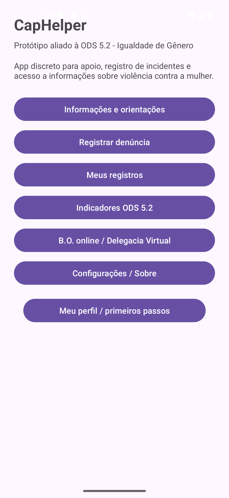
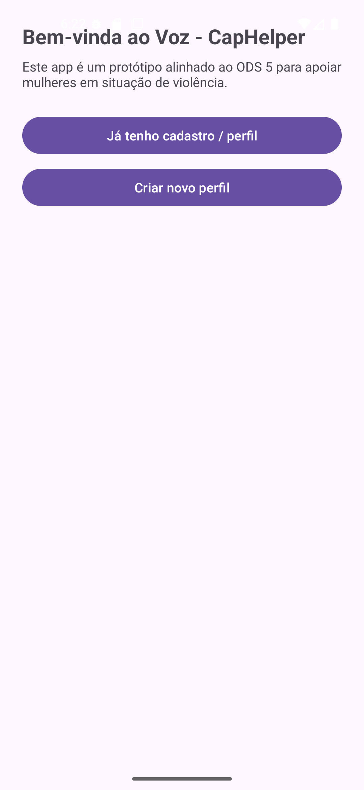
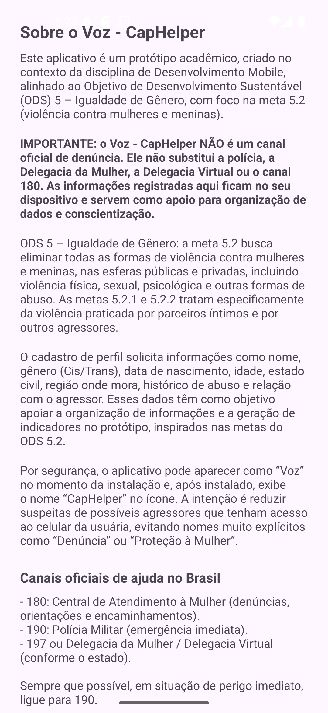
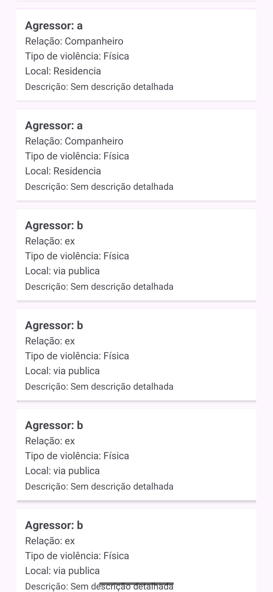
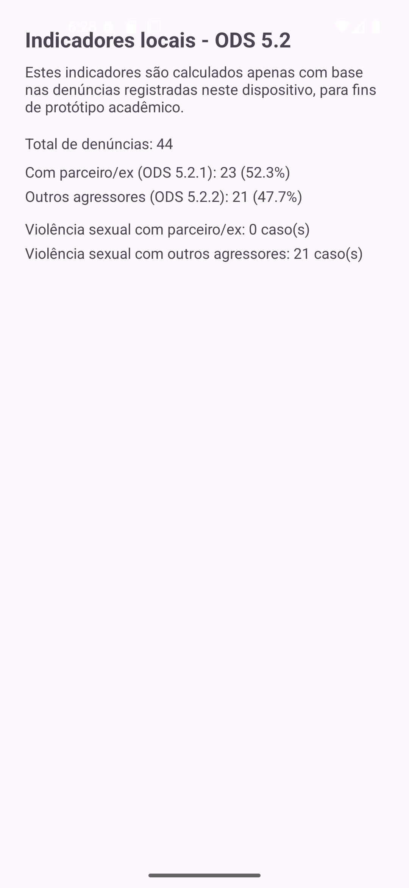
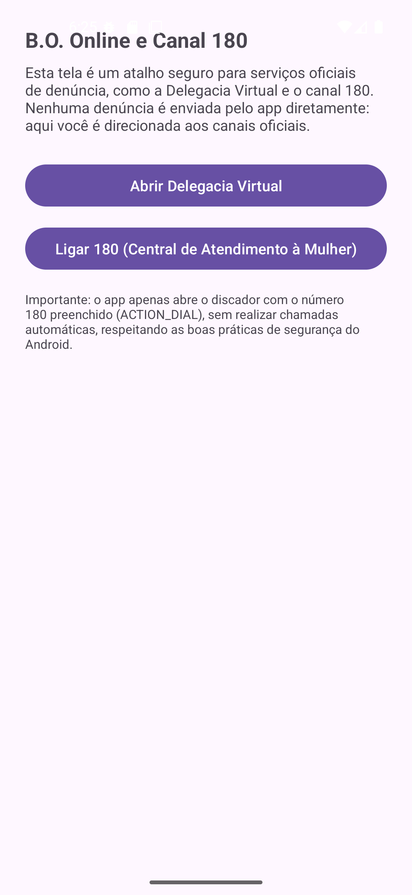
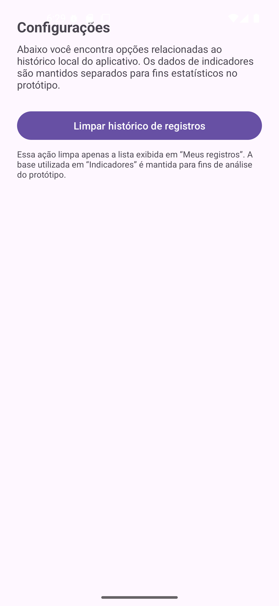

## Dados do Projeto

- **Curso:** Análise e Desenvolvimento de Sistemas (ADS) – UNICEUB
- **Disciplina:** Programação para Dispositivos Móveis
- **Professor:** Romes Heriberto Pires de Araújo
- **Turma:** B - 0925 - Virtual - GV2
- **Semestre:** 2025/2

- **Integrantes do grupo:**
    - Helena Henriques Lasquevite (RA: 72450125)
    - Rodrigo Póvoa Braule Pinto Júnior (RA: 72450800)

## Observação: 
O código-fonte principal do protótipo está no branch `master` deste repositório.

# Voz - "CapHelper"

Protótipo de aplicativo Android nativo (Kotlin) alinhado ao **ODS 5 – Igualdade de Gênero**, com foco nas **metas 5.2, 5.2.1 e 5.2.2** da ONU: eliminar todas as formas de violência contra mulheres e meninas, incluindo violência doméstica, violência sexual e outras formas de abuso nas esferas pública e privada.

O Voz - CapHelper **não é um canal oficial de denúncia**, mas sim um **protótipo acadêmico** que simula fluxos de registro de ocorrências e oferece **atalhos seguros** para serviços oficiais como **Delegacia Virtual** e **canal 180**, além de trazer informativos sobre **violência contra a mulher** com finalidade de incentivar a denúncia e a busca por ajuda.

Além disso, produzir indicadores simplificados baseados nos dados preenchidos pela usuária permite simular uma base de dados atualizada em tempo “real” para fins acadêmicos.

---

## 1. ODS, Metas e Contexto

### 1.1. ODS escolhida

- **ODS 5 – Igualdade de Gênero**
- **Meta 5.2**: *“Eliminar todas as formas de violência contra todas as mulheres e meninas nas esferas públicas e privadas, incluindo o tráfico e exploração sexual e de outros tipos.”*

Metas relacionadas utilizadas como referência:

- **5.2.1** – Proporção de mulheres e meninas (15+) que sofreram violência física, sexual ou psicológica por parte de parceiro íntimo atual ou anterior, nos últimos 12 meses, por idade e forma de violência.
- **5.2.2** – Proporção de mulheres e meninas (15+) que sofreram violência sexual por pessoas que **não** são parceiros íntimos, nos últimos 12 meses, por idade e local de ocorrência.

### 1.2. Contexto brasileiro

O Brasil apresenta índices elevados de violência contra a mulher, incluindo violência doméstica, feminicídios e violência sexual, com recortes ainda mais graves quando cruzados com **raça, classe, território e outras vulnerabilidades**. Políticas públicas como a **Lei Maria da Penha** e o fortalecimento de canais oficiais de denúncia são fundamentais, mas o acesso à informação e a canais de apoio ainda é desigual.

O **Voz - CapHelper** se inspira nesse cenário para propor:

- Um **fluxo guiado** de coleta de informações sobre violência;
- Uma **base de registros locais** (no dispositivo) com dados relevantes para análise;
- Uma **leitura simplificada de indicadores**, aproximando o usuário das metas 5.2.1 e 5.2.2;
- Atalhos para **canais oficiais** (Delegacia Virtual e 180), sem substituir o papel do Estado;
- Acesso à **informação** simplificado sobre **igualdade de gênero** e violência de gênero;
- Incentivo à **denúncia** contra os agressores, sempre por meio dos canais oficiais.

---

## 2. Descrição do Problema

Mulheres e meninas em situação de violência frequentemente enfrentam:

- Dificuldade em reconhecer que determinados comportamentos são formas de **violência (física, sexual, psicológica, moral, patrimonial)**;
- Medo, vergonha ou falta de confiança para procurar ajuda formal;
- Dificuldade em organizar informações sobre **quem é o agressor**, **tipo de violência**, **local**, **frequência**;
- Falta de ferramentas que conectem, de forma simples, o **registro da experiência** com os **canais oficiais de denúncia**.

Ao mesmo tempo, políticas públicas alinhadas ao ODS 5 dependem de **dados estruturados** sobre violência de gênero para:

- Monitorar a incidência por tipo de violência;
- Diferenciar violações cometidas por **parceiros íntimos** e por **outros agressores**;
- Entender perfis de vítimas, faixas etárias e contextos.

O problema que o Voz - CapHelper se propõe a atacar é:

> **“Como apoiar mulheres e meninas na organização de informações sobre situações de violência de gênero, oferecendo um fluxo respeitoso e seguro de registro, além de facilitar o acesso a canais oficiais de denúncia, ao mesmo tempo em que gera indicadores simples inspirados nas metas 5.2.1 e 5.2.2 do ODS 5?”**

---

## 3. Justificativa

Este protótipo busca integrar:

- **Impacto social** (ODS 5, metas 5.2, 5.2.1 e 5.2.2);
- Com **boas práticas de engenharia de software** e de **qualidade de produto**:

    - **ISO/IEC 25010** – modelo de qualidade de produto de software (usabilidade, confiabilidade, segurança, desempenho, manutenibilidade etc.);
    - **ISO 9241** – ergonomia da interação humano-sistema, com foco em usabilidade, feedback e acessibilidade;
    - **ABNT NBR ISO/IEC 9126** – modelo de qualidade para produtos de software (referência histórica que antecede a ISO 25010).

Além disso:

- Aproxima a prática de desenvolvimento mobile de um **contexto real de política pública e direitos humanos**;
- Exercita **modelagem de dados**, **persistência local**, **navegação**, **UX** e **tratamento cuidadoso de informações sensíveis**;
- Permite discutir limites éticos: o app **não substitui serviços oficiais**, nem promete anonimato ou validade jurídica.

### 3.1. Nome e disfarce do aplicativo

Por se tratar de um protótipo focado em mulheres em situação de violência, foi adotada uma estratégia de **disfarce de nome**, comum em soluções de apoio e segurança doméstica:

- Na hora de baixar/instalar, o aplicativo aparece com o nome **“Voz”**: *o aplicativo que dá voz às mulheres*;
- Após instalado, o ícone na tela do dispositivo passa a exibir o nome **“CapHelper”**¹.

¹ O nome "CapHelper" foi inspirado após uma pesquisa sobre aplicativos populares entre mulheres, como o **CapCut**, um app de edição de vídeo. A ideia é que o ícone/nome lembre algo cotidiano e não suspeito.

A intenção é **reduzir a suspeita de agressores** que possam ter acesso ao celular da vítima, evitando nomes muito explícitos como “Denúncia”, “Violência Doméstica”, “Proteção à Mulher” etc. Embora este seja um protótipo acadêmico, a escolha do nome e do disfarce foi pensada para se aproximar de boas práticas de segurança em contextos de violência de gênero.

---

## 4. Público-Alvo

Público-alvo principal:

- **Mulheres (cis e trans)** maiores de 15 anos, que:
    - Vivem ou viveram situações de violência física, sexual, psicológica, moral ou patrimonial;
    - Precisam organizar mentalmente e por escrito o que aconteceu (quem, quando, onde, como);
    - Desejam se aproximar dos **canais oficiais de denúncia**, mas se sentem mais confortáveis começando por um ambiente guiado e informativo;
    - Desejam se informar sobre tipos de violência, direitos e canais oficiais.

Públicos secundários:

- **Profissionais de apoio** (assistência social, psicologia, saúde, ONGs), que podem utilizar o protótipo como referência de fluxo de atendimento;
- **Pesquisadores e estudantes** interessados em unir **ODS, políticas públicas, UX e desenvolvimento mobile**.

---

## 5. Objetivos do Aplicativo

### 5.1. Objetivo geral

> **Propor e implementar um protótipo de aplicativo Android nativo que apoie mulheres em situação de violência na organização de informações sobre suas experiências, simule o registro de denúncias e apresente indicadores inspirados nas metas 5.2.1 e 5.2.2 do ODS 5, além de facilitar o acesso a serviços oficiais de denúncia.**

### 5.2. Objetivos específicos

- Coletar dados de **perfil** da usuária, incluindo:
    - Nome completo;
    - **Gênero** (Cis ou Trans);
    - Data de nascimento e idade (quando informada);
    - Estado civil;
    - Região onde mora;
    - Se já sofreu algum tipo de abuso;
    - Relação com o agressor principal (ex.: parceiro atual, ex-parceiro, familiar).

- Permitir o **registro de denúncias** contendo:
    - Nome do agressor;
    - Relação com o agressor;
    - Tipo de violência (`FISICA`, `SEXUAL`, `PSICOLOGICA`, `MORAL`, `PATRIMONIAL`, `OUTRA`);
    - Local da ocorrência;
    - Descrição textual.

- Manter um **histórico local** de denúncias (não sincronizado com servidor):
    - Para consulta na tela **“Meus registros”**;
    - Independente da área de indicadores (que usa a visão agregada desses dados).

- Exibir uma tela de **indicadores simples** inspirados nas metas:
    - Número total de denúncias;
    - Denúncias em que o agressor é parceiro/ex (ligadas à meta **5.2.1**);
    - Denúncias em que o agressor não é parceiro íntimo (meta **5.2.2**);
    - Casos de violência sexual para cada um desses grupos.

- Disponibilizar uma tela **B.O. Online** com:
    - Atalho para **Delegacia Virtual** (navegador via `Intent.ACTION_VIEW`);
    - Atalho para o canal **180**, abrindo apenas o discador (`Intent.ACTION_DIAL`) com o número preenchido, respeitando as boas práticas de segurança e permissões do Android.

- Exercitar boas práticas de:
    - Navegação com **Navigation Component**;
    - Organização de código em **Fragments** e pacotes (`ui.auth`, `ui.home`, `ui.denuncia`, `ui.indicadores`, `ui.registros`, `ui.boonline`, `ui.config`);
    - Persistência simples com `SharedPreferences` para o perfil;
    - Repositório em memória para denúncias (`DenunciaRepository`).

---

## 6. Tipo de Aplicação

- **Tipo:** Aplicativo **Nativo Android**
- **Linguagem:** Kotlin
- **Arquitetura básica:**
    - Activity principal com **NavHostFragment** e `nav_graph.xml`;
    - Vários **Fragments** para telas;
    - Repositório em memória (`DenunciaRepository`) para denúncias;
    - `SharedPreferences` para armazenamento de perfil da usuária (`UserRepository`, `Perfil`, `Genero`).

---

## 7. Arquitetura e Fluxo de Navegação

### 7.1. Fluxo principal

1. **AuthFragment (Boas-vindas)**
    - Tela inicial do app (`startDestination` do `nav_graph`).
    - Dois botões:
        - **“Já tenho cadastro / perfil”** → `LoginFragment`
        - **“Criar novo perfil”** → `CadastroFragment`

2. **LoginFragment**
    - MVP de login simplificado:
        - Botão **“Entrar”**:
            - Se `UserRepository.hasPerfil()` for **true** → navega para `HomeFragment`;
            - Se **false** → redireciona para `CadastroFragment`.
    - Campos de e-mail/senha são opcionais no protótipo, prevendo futura expansão.

3. **CadastroFragment**
    - Coleta formulário de perfil:
        - Nome completo (`etNomeCompleto`);
        - Gênero (`Genero.CIS` ou `Genero.TRANS`);
        - Data de nascimento e idade (idade opcional para o MVP);
        - Estado civil;
        - Região onde mora;
        - Se já sofreu algum abuso (checkbox);
        - Relação com o agressor (texto).
    - Valida campos essenciais e exige aceite de termos:
        - Checkbox “Li e aceito os termos...”.
    - Salva o perfil via `UserRepositoryImpl` em `SharedPreferences`.
    - Após salvar, navega para `HomeFragment`.
    - A Home também possui um botão **“Meu perfil / primeiros passos”** que reabre o `CadastroFragment` para edição.

4. **HomeFragment**
    - Apresenta o nome interno do app (**CapHelper**) e um texto de contexto sobre ODS 5.
    - Botões para:
        - **Informações** (`InfoFragment`);
        - **Denúncia** (`DenunciaFragment`);
        - **Meus registros** (`RegistrosFragment`);
        - **Indicadores** (`IndicadoresFragment`);
        - **B.O. online** (`BoOnlineFragment`);
        - **Configurações** (`ConfigFragment`);
        - **Meu perfil / primeiros passos** → `CadastroFragment`.

5. **DenunciaFragment**
    - Formulário de registro de denúncia com:
        - Nome do agressor;
        - Relação com o agressor;
        - Tipo de violência (texto mapeado para o enum `TipoViolencia`);
        - Local da ocorrência;
        - Descrição.
    - Valida campos principais (agressor, tipo de violência, local).
    - Cria um objeto `Denuncia` e o envia para `DenunciaRepository.adicionarDenuncia(denuncia)`.
    - Exibe mensagem de sucesso.
    - Navega para **“Meus registros”** (`RegistrosFragment`).

6. **RegistrosFragment**
    - Tela para exibir o histórico local de denúncias (somente no dispositivo).
    - Lê as denúncias armazenadas no `DenunciaRepository` e as apresenta em lista (um card para cada denúncia).

7. **IndicadoresFragment**
    - Obtém lista de denúncias via `DenunciaRepository.listarDenunciasIndicadores()`.
    - Calcula:
        - Total de denúncias;
        - Denúncias em que a relação com o agressor indica **parceiro ou ex** (critério textual simples com palavras-chave: “companheiro”, “namorado”, “marido”, “parceiro”, “ex” etc.);
        - Denúncias com outros agressores;
        - Casos de **violência sexual** (`TipoViolencia.SEXUAL`) em cada grupo.
    - Exibe textos do tipo:
        - `Com parceiro/ex (ODS 5.2.1): X (Y%)`
        - `Outros agressores (ODS 5.2.2): Z (W%)`
        - `Violência sexual com parceiro/ex: N caso(s)`
        - `Violência sexual com outros agressores: M caso(s)`

8. **BoOnlineFragment**
    - Tela com:
        - Botão **“Abrir Delegacia Virtual”** → abre URL oficial da Delegacia Virtual no navegador (`Intent.ACTION_VIEW`);
        - Botão **“Ligar 180”** → abre o discador com o número 180 (`Intent.ACTION_DIAL`), **sem** realizar a chamada automaticamente.
    - **Boas práticas de segurança:**
        - Não utiliza `ACTION_CALL` (que exigiria permissão sensível `CALL_PHONE`);
        - Usa `ACTION_DIAL`, deixando o controle da chamada com a usuária;
        - Facilita a descrição, no README, do respeito às diretrizes de permissões do Android.

9. **ConfigFragment**
    - Tela destinada, no protótipo atual, a:
        - Limpar histórico local de denúncias exibidas em **“Meus registros”**, sem afetar a base usada em **Indicadores**;
    - Pensada para comportar futuras configurações, como:
        - Ajustes de acessibilidade;
        - Eventual exclusão/anonimização mais profunda de dados.

---

## 8. Persistência de Dados

### 8.1. Perfil da usuária

- Persistência via `SharedPreferences`:
    - Implementado em `UserRepositoryImpl`.
    - Armazena:
        - `perfil_nome_completo`
        - `perfil_genero` (string do enum: `CIS` ou `TRANS`)
        - `perfil_data_nascimento`
        - `perfil_idade` (inteiro opcional)
        - `perfil_estado_civil`
        - `perfil_regiao`
        - `perfil_ja_sofreu_abuso` (boolean)
        - `perfil_relacao_agressor`

### 8.2. Denúncias

- Utiliza `DenunciaRepository` (em memória) no escopo do protótipo:
    - Lista de `Denuncia` mantida enquanto o app está aberto.
    - Pode ser posteriormente evoluído para `Room/SQLite` conforme o escopo da disciplina exigir.

---

## 9. Instalação, Execução e Uso

### 9.1. Requisitos do Sistema

- **Plataforma:** Android
- **SDK mínimo sugerido:** API 21+ (Android 5.0 ou superior)
- **Linguagem:** Kotlin
- **IDE:** Android Studio (versão recente – Electric Eel ou superior recomendado)
- **Build system:** Gradle (configurado automaticamente pelo Android Studio)

### 9.2. Clonagem / Importação do Projeto

1. Baixe o código-fonte do projeto (via Git clone ou .zip), por exemplo:
    - `git clone https://github.com/laskevite-prog/voz_caphelper.git`
    - ou baixe o `caphelper.zip` e extraia em uma pasta local.

2. Abra o **Android Studio**:
    - Menu **File > Open...**
    - Selecione a pasta raiz do projeto (onde está o `build.gradle` do módulo `app`).

3. Aguarde a sincronização do Gradle:
    - O Android Studio pode baixar dependências na primeira execução.
    - Caso necessário, use **File > Sync Project with Gradle Files**.

### 9.3. Executando o app em emulador ou dispositivo físico

#### 9.3.1. Emulador (AVD)

1. No Android Studio, abra o **AVD Manager**:
    - Ícone de dispositivo na barra de ferramentas
    - ou **Tools > Device Manager**.

2. Crie um novo dispositivo virtual:
    - Escolha um modelo (ex.: Pixel 3, Pixel 4 etc.);
    - Escolha uma imagem de sistema (ex.: Android 11, API 30).

3. Inicie o emulador.

4. No topo do Android Studio, selecione o emulador na lista de dispositivos.

5. Clique em **Run ▶** (ou **Shift + F10**).  
   O app será instalado e iniciado no emulador.

#### 9.3.2. Dispositivo físico (celular Android)

1. No celular:
    - Ative o **Modo Desenvolvedor** (configurações → sobre o telefone → tocar várias vezes em “Número da versão”);
    - Ative **Depuração USB** nas opções de desenvolvedor.

2. Conecte o celular ao computador via cabo USB.

3. No Android Studio:
    - O dispositivo deve aparecer na lista de dispositivos disponíveis;
    - Se for solicitado no celular, aceite a permissão de depuração USB.

4. Selecione o dispositivo físico e clique em **Run ▶**.  
   O app será instalado e aberto no celular.

### 9.4. Observação sobre o nome do aplicativo (Voz → CapHelper)

Por questões de segurança e privacidade para mulheres em situação de violência doméstica, o protótipo adotou uma estratégia de **disfarce de nome**:

- Durante o processo de instalação, o app pode aparecer como **“Voz”**;
- Após instalado, o nome exibido no ícone do app é **“CapHelper”**.

A ideia é reduzir suspeitas de agressores que tenham acesso ao celular da vítima, evitando nomes muito explícitos como “Denúncia”, “Violência Doméstica” ou “Proteção à Mulher”. Essa decisão de UX faz parte do cuidado com o contexto da ODS 5 e das dinâmicas de violência de gênero.

### 9.5. Uso (fluxo básico dentro do app)

1. Abrir o app (ícone **CapHelper**).
2. Tela **Auth (Boas-vindas)**:
    - **“Já tenho cadastro / perfil”** → vai para **Login**;
    - **“Criar novo perfil”** → vai para **Cadastro**.
3. Na primeira utilização, recomenda-se:
    - Preencher o **Cadastro** (Perfil) com:
        - Nome completo;
        - Gênero (Cis/Trans);
        - Data de nascimento / idade;
        - Estado civil;
        - Região onde mora;
        - Informação se já sofreu abuso e relação com o agressor.
4. Após o cadastro, o app navega para a **Home**, onde é possível:
    - Registrar uma **Denúncia**;
    - Consultar **Meus registros** (histórico local);
    - Ver **Indicadores** (vinculados a ODS 5.2.1 e 5.2.2);
    - Acessar **B.O. online** (Delegacia Virtual e canal 180 via `ACTION_VIEW` e `ACTION_DIAL`);
    - Editar o perfil em **“Meu perfil / primeiros passos”**;
    - Ajustar comportamentos futuros em **Configurações** (limpar histórico, etc., conforme implementado).

---

## 10. Evidências Visuais (Screenshots)

As imagens abaixo ilustram o funcionamento do protótipo Voz - CapHelper em execução no emulador/dispositivo Android.  
Os arquivos estão localizados na pasta `/screenshots` do projeto.

### 10.1. Visão geral das telas

Imagem com uma visão geral das principais telas do aplicativo (Home, Denúncia, Registros, Indicadores, B.O. Online, Configurações e Informações):

---

### 10.2. Tela Home

Tela inicial após autenticação e cadastro de perfil, apresentando os principais acessos: Informações, Denúncia, Meus Registros, Indicadores, B.O. Online, Configurações e “Meu perfil / primeiros passos”.

---

### 10.3. Tela de Informações (Sobre o app)

Tela com a explicação sobre o Voz - CapHelper como protótipo acadêmico, vínculo com o ODS 5 e meta 5.2, aviso de que não é um canal oficial de denúncia e indicação de canais oficiais (180, 190, Delegacia Virtual etc.), além da explicação sobre o nome “Voz” / “CapHelper”.

---

### 10.4. Tela Meus Registros

Tela que exibe o histórico local de denúncias registradas no dispositivo, mostrando agressor, relação com o agressor, tipo de violência, local e um trecho da descrição de cada caso.

---

### 10.5. Tela de Indicadores (ODS 5.2.1 e 5.2.2)

Tela que apresenta indicadores simples inspirados nas metas 5.2.1 e 5.2.2 do ODS 5, separando denúncias em dois grupos: violência cometida por parceiro/ex e por outros agressores, com destaque para os casos de violência sexual em cada grupo.

---

### 10.6. Tela B.O. Online

Tela que funciona como atalho seguro para serviços oficiais: botão para abrir a Delegacia Virtual no navegador (`ACTION_VIEW`) e botão para abrir o discador com o número 180 preenchido (`ACTION_DIAL`), sem realizar chamadas automáticas, respeitando as boas práticas de segurança do Android.

---

### 10.7. Tela de Configurações

Tela onde a usuária pode, no protótipo atual, limpar o histórico local de registros exibidos em “Meus Registros”, sem afetar a base utilizada em “Indicadores”, reforçando a separação entre dados pessoais de consulta e dados agregados para análise.

---

## 11. Qualidade, UX e Acessibilidade

- Uso de **Fragments** e **Navigation Component** para um fluxo claro e estruturado;
- Telas com texto explicativo sobre:
    - O caráter de protótipo;
    - O vínculo com ODS 5;
    - O limite de responsabilidade do app (não é canal oficial de denúncia);
- Botão de B.O. Online seguindo as boas práticas de segurança de permissões Android:
    - `ACTION_DIAL` em vez de `ACTION_CALL`;
- Estrutura preparada para futuras melhorias:
    - Acessibilidade (contraste, tamanho de fonte, leitura de tela);
    - Internacionalização;
    - Persistência robusta (Room/SQLite).

---

## 12. Referências

- **ONU – Objetivos de Desenvolvimento Sustentável (ODS)**
    - ODS 5 – Igualdade de Gênero e metas 5.2, 5.2.1 e 5.2.2.

- **Normas de qualidade e usabilidade**
    - ABNT NBR ISO/IEC 25010:2011 – Sistemas e software de engenharia — Modelos de qualidade de produto;
    - ABNT NBR ISO 9241 – Ergonomia da interação humano-sistema;
    - ABNT NBR ISO/IEC 9126 – Engenharia de software — Qualidade de produto (substituída pela 25010, mas ainda amplamente referenciada).

- **Guia de design**
    - Google Material Design.

- **Engenharia de Software (fundamentação teórica)**
    - Pressman, R.; Maxim, B. *Engenharia de Software*, 9ª ed.;
    - Sommerville, I. *Engenharia de Software*, 10ª ed.
